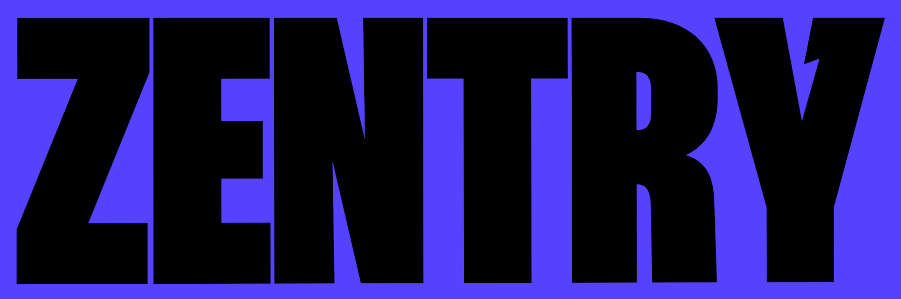

    
  
  
  
  
  

  <b>Step into the New Era of Gaming Together </b> 

## 📖 Overview

An immersive gaming platform landing page built with React, TailwindCSS, and GSAP. Experience **stunning effects**, **scroll-triggered animations**, **dynamic video transitions**, and an interactive audio-visual journey through the 'Game of Games' universe.

## ⚡ Try it Live

## ✨ Features

- Immersive 3D card transformations
- Dynamic audio integration with visual feedback
- Smooth scroll animations powered by Lenis
- Advanced clip-path masking effects
- Responsive design with mobile-first approach
- Custom font implementations
- Interactive hover states and micro-animations

## 🛠️ Tech Stack

- **Framework**: React 18
- **Styling**: TailwindCSS
- **Animations**: GSAP

## 🌟 Credits

This project is a clone of [Zentry](https://zentry.com) created as a learning excercise. All design credits go to the original Zentry team.

## 📝 License

This project is licensed under the MIT License - see the [LICENSE](LICENSE) file for details.

---

  Made with ❤️ by Aditya Singh

   

  
  

